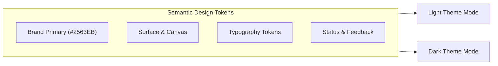
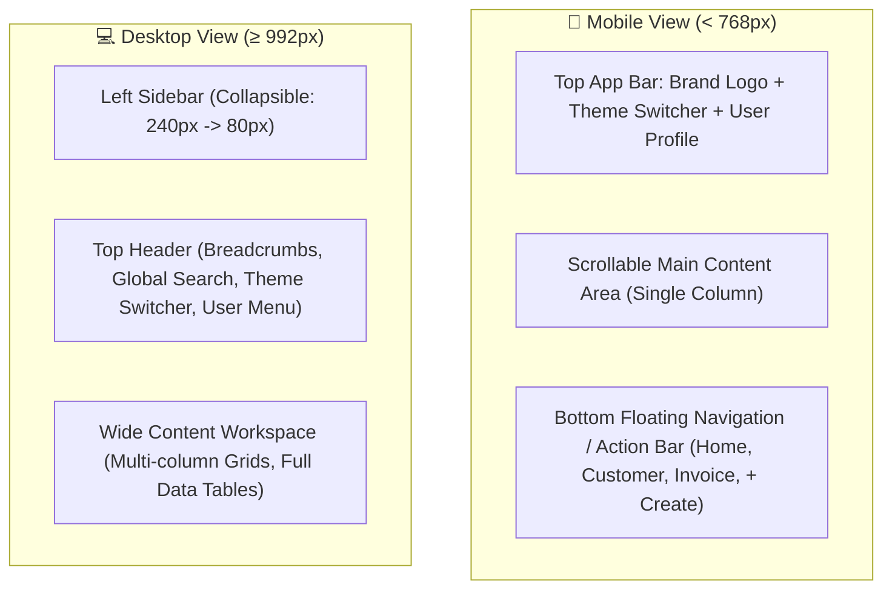
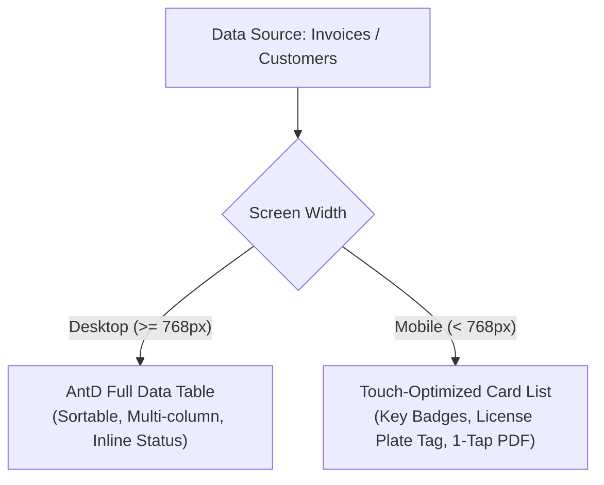
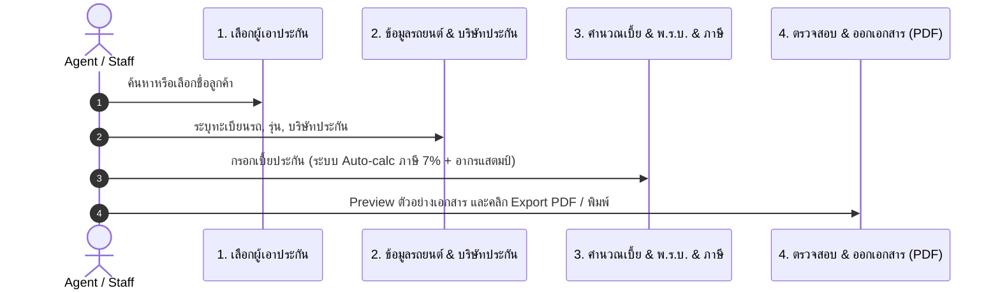

# 🎨 UI/UX Design System Specification

> **Insurance Invoice & Quotation Management System**  
> *Mobile-First • Minimal & Clean • Responsive Desktop • Native Dark Mode*

---

## 📑 Table of Contents

1. [Design Philosophy & Core Principles](#-1-design-philosophy--core-principles)
2. [Design Tokens & Theme Architecture](#-2-design-tokens--theme-architecture)
   - [2.1 Color Palette & Semantic Tokens](#21-color-palette--semantic-tokens)
   - [2.2 Typography Scale](#22-typography-scale)
   - [2.3 Spacing & Layout Grid](#23-spacing--layout-grid)
   - [2.4 Elevation, Shadows & Borders](#24-elevation-shadows--borders)
3. [Responsive & Adaptive Architecture](#-3-responsive--adaptive-architecture)
   - [3.1 Breakpoint Strategy](#31-breakpoint-strategy)
   - [3.2 Navigation & Layout Structure](#32-navigation--layout-structure)
   - [3.3 Mobile-First Interaction Patterns](#33-mobile-first-interaction-patterns)
4. [Dark Mode Implementation](#-4-dark-mode-implementation)
   - [4.1 Color Elevation & Surface Strategy](#41-color-elevation--surface-strategy)
   - [4.2 Theme Switching & Persistence](#42-theme-switching--persistence)
   - [4.3 PDF Export vs App Theme Isolation](#43-pdf-export-vs-app-theme-isolation)
5. [Component Design System](#-5-component-design-system)
   - [5.1 Buttons & Touch Targets](#51-buttons--touch-targets)
   - [5.2 Form Inputs & Controls](#52-form-inputs--controls)
   - [5.3 Data Presentation: Tables vs. Cards](#53-data-presentation-tables-vs-cards)
   - [5.4 Modals, Drawers & Bottom Sheets](#54-modals-drawers--bottom-sheets)
   - [5.5 Feedback, Skeletons & Empty States](#55-feedback-skeletons--empty-states)
6. [Domain-Specific UX Flows](#-6-domain-specific-ux-flows)
   - [6.1 Dashboard & Metrics Overview](#61-dashboard--metrics-overview)
   - [6.2 Quotation & Invoice Creation Flow](#62-quotation--invoice-creation-flow)
   - [6.3 Customer & Insurance Company Management](#63-customer--insurance-company-management)
7. [Technical Implementation Guide (React + AntD + styled-components)](#-7-technical-implementation-guide)

---

## 🌟 1. Design Philosophy & Core Principles

### 1. Mobile-First Mindset
- Every interface is architected for single-thumb mobile operation first, then gracefully expands to maximize productivity on tablets, laptops, and ultra-wide desktop monitors.
- Critical actions are anchored within natural thumb reach zones (bottom navigation, floating action bars, bottom action sheets).

### 2. Minimal, Functional & Clean
- **Content-First**: High data density without visual noise. Eliminate superfluous borders, gradients, and decorative distractions.
- **Micro-Hierarchy**: Crisp typography, high scannability, subtle separators, and intentional negative space (`16px`/`24px` base rhythm).
- **Zero Confusion**: Clear financial numbers (policy premium, 7% VAT, stamp duty, gross total) with prominent visual anchors.

### 3. Purposeful Dark Mode
- Dark mode is not an afterthought; it is a first-class citizen designed to reduce eye strain in low-light operational environments.
- Uses desaturated primary accents and multi-layered elevation surfaces (rather than pure `#000000`) to preserve depth and readability.

### 4. Speed & Responsiveness
- Instant feedback on interactions (< 100ms perceived response).
- Progressive loading with skeleton placeholders instead of blocking full-screen loaders where possible.

---

## 🎨 2. Design Tokens & Theme Architecture

### 2.1 Color Palette & Semantic Tokens

The color system is organized into semantic tokens mapped across **Light** and **Dark** themes.

| Token | Light Theme | Dark Theme | Purpose / Usage |
| :--- | :--- | :--- | :--- |
| **`bg-canvas`** | `#F8FAFC` (Slate 50) | `#0F172A` (Slate 900) | Root background |
| **`bg-surface`** | `#FFFFFF` | `#1E293B` (Slate 800) | Cards, Modals, Popovers |
| **`bg-surface-subtle`**| `#F1F5F9` (Slate 100) | `#334155` (Slate 700) | Table headers, chip backgrounds |
| **`text-primary`** | `#0F172A` (Slate 900) | `#F8FAFC` (Slate 50) | Main headings, key values |
| **`text-secondary`** | `#475569` (Slate 600) | `#94A3B8` (Slate 400) | Labels, metadata, captions |
| **`text-muted`** | `#94A3B8` (Slate 400) | `#64748B` (Slate 500) | Placeholders, disabled text |
| **`border-subtle`** | `#E2E8F0` (Slate 200) | `#334155` (Slate 700) | Card dividers, input borders |
| **`brand-primary`** | `#2563EB` (Blue 600) | `#3B82F6` (Blue 500) | Main action buttons, active states |
| **`brand-primary-hover`**| `#1D4ED8` (Blue 700) | `#60A5FA` (Blue 400) | Hover / focus active |
| **`brand-primary-bg`** | `#EFF6FF` (Blue 50) | `#1E3A8A33` (Blue 900/20) | Active menu item background |
| **`status-success`** | `#10B981` (Emerald 500)| `#34D399` (Emerald 400)| Paid, Active, Completed |
| **`status-warning`** | `#F59E0B` (Amber 500) | `#FBBF24` (Amber 400) | Pending, Expiring soon |
| **`status-danger`** | `#EF4444` (Red 500) | `#F87171` (Red 400) | Overdue, Cancelled, Errors |



---

### 2.2 Typography Scale

Utilizes system font stack optimized for performance and native feel on iOS, Android, macOS, and Windows.

- **Font Family**: `-apple-system, BlinkMacSystemFont, 'Prompt', 'Kanit', 'Segoe UI', Roboto, Helvetica, Arial, sans-serif`
- *Note*: Thai typography support (`Prompt` / `Kanit`) is included for seamless Thai insurance terms.

| Style Name | Size | Line Height | Weight | Usage |
| :--- | :--- | :--- | :--- | :--- |
| **Display** | `28px` (1.75rem) | `1.2` | Bold (`700`) | Key metric counters, Login headline |
| **Heading 1** | `22px` (1.375rem)| `1.3` | SemiBold (`600`)| Page titles |
| **Heading 2** | `18px` (1.125rem)| `1.4` | SemiBold (`600`)| Section titles, Modal headers |
| **Body Large** | `16px` (1rem) | `1.5` | Regular (`400`)| Card titles, Main inputs |
| **Body Base** | `14px` (0.875rem)| `1.5` | Regular / Medium | Standard text, Table rows, Labels |
| **Caption** | `12px` (0.75rem) | `1.4` | Regular (`400`)| Timestamps, badge labels, hints |

---

### 2.3 Spacing & Layout Grid

Adheres strictly to an **8-point base grid** with a 4-point sub-grid for micro-alignments.

```
2px (xxs) | 4px (xs) | 8px (sm) | 12px (md) | 16px (lg) | 24px (xl) | 32px (2xl) | 48px (3xl)
```

- **Mobile Screen Padding**: `16px` horizontal edge padding
- **Desktop Content Max Width**: `1280px` (centered for wide screens)
- **Component Gap**: `12px` (mobile cards), `16px` - `24px` (desktop grids)

---

### 2.4 Elevation, Shadows & Borders

| Level | Light Mode Shadow | Dark Mode Treatment | Usage |
| :--- | :--- | :--- | :--- |
| **Level 0 (Flat)** | `none`, `1px border-subtle` | `none`, `1px border-subtle` | Basic table cells, inputs |
| **Level 1 (Card)** | `0 1px 3px rgba(0,0,0,0.06), 0 1px 2px rgba(0,0,0,0.04)` | `bg-surface` (`#1E293B`) + subtle border | Metric cards, list items |
| **Level 2 (Dropdown/Popover)** | `0 4px 6px -1px rgba(0,0,0,0.08), 0 2px 4px -2px rgba(0,0,0,0.05)` | Elevation glow + `#334155` border | Select dropdowns, context menus |
| **Level 3 (Modal/Sheet)** | `0 20px 25px -5px rgba(0,0,0,0.12)` | Dark backdrop (`rgba(0,0,0,0.7)`) + `#1E293B` | Mobile bottom sheet, Dialog modals |

- **Border Radius Standards**:
  - Small Controls (Badges, tags): `4px` - `6px`
  - Inputs & Buttons: `8px`
  - Cards, Containers & Dialogs: `12px` - `16px`
  - Floating Action Buttons / Avatars: `9999px` (Pill / Circular)

---

## 📱 3. Responsive & Adaptive Architecture

### 3.1 Breakpoint Strategy

```
Mobile (< 576px)  ───►  Tablet (576px - 991px)  ───►  Desktop (≥ 992px)  ───►  Wide (≥ 1280px)
```

- **`xs` (< 576px)**: Mobile portrait & small screens. Single column, stacked cards, bottom navigation / drawer.
- **`sm` / `md` (576px - 991px)**: Tablet portrait / landscape. 2-column card layouts, collapsed icon sidebar.
- **`lg` / `xl` (≥ 992px)**: Desktop. Full expanded sidebar, multi-column dashboard, dense data tables.

---

### 3.2 Navigation & Layout Structure



#### Mobile Navigation Layout
1. **Top App Bar (`56px` height)**:
   - Left: Hamburger toggle (or back button for nested screens)
   - Center: Current page title or compact logo
   - Right: Quick Dark/Light mode toggle + User Avatar
2. **Bottom Quick Action Bar (`64px` height)**:
   - Primary destinations: **Dashboard**, **ลูกค้า (Customers)**, **ใบเสนอราคา (Quotations)**, **ใบวางบิล (Invoices)**
   - Center Primary Action: Highlighted `+` Button for instant Quotation / Invoice generation.

#### Desktop Navigation Layout
1. **Persistent Sidebar (`240px` expanded / `72px` compact)**:
   - Brand Logo with version badge
   - Navigation links with clear active indicator (left colored border pill + soft brand background)
   - Collapse toggle at the bottom
2. **Top Header**:
   - Dynamic breadcrumb trail
   - Global Quick Search (customers, license plates, invoice numbers)
   - Dark/Light mode switch, system alerts, user profile dropdown

---

### 3.3 Mobile-First Interaction Patterns

1. **Thumb-Friendly Touch Targets**:
   - Minimum clickable target size: **`44px × 44px`** for all buttons, inputs, and list rows.
   - Generous spacing between interactive elements to avoid accidental taps.
2. **Pull-to-Refresh & Infinite/Paginated Scroll**:
   - On mobile list screens (Customers, Invoices), provide smooth pull-to-refresh and compact pagination controls.
3. **Sticky Action Bars**:
   - Form submission and step-action buttons stick to the viewport bottom on mobile with a frosted glass backdrop (`backdrop-filter: blur(8px)`).

---

## 🌙 4. Dark Mode Implementation

### 4.1 Color Elevation & Surface Strategy

Dark mode avoids pure black (`#000000`) for surfaces to prevent harsh contrast and smearing on OLED displays:
- **Base Canvas**: `#0F172A` (Rich Dark Slate)
- **Card / Surface Level 1**: `#1E293B`
- **Surface Level 2 (Hover / Sub-card)**: `#273549`
- **Border**: `#334155` (Subtle separator)
- **Text Primary**: `#F8FAFC` (Soft white, 95% opacity)
- **Text Secondary**: `#94A3B8` (Slate 400, 70% opacity)

### 4.2 Theme Switching & Persistence
1. **Detection**: Checks `localStorage.getItem('theme')`. If unset, defaults to system preference via `window.matchMedia('(prefers-color-scheme: dark)')`.
2. **Toggle Control**: Accessible pill toggle with animated Sun ☀️ and Moon 🌙 icons in the header.
3. **Smooth Transition**: CSS property transitions applied to background and color (`transition: background-color 0.25s ease, color 0.2s ease`).

### 4.3 PDF Export vs App Theme Isolation
> [!IMPORTANT]
> Official PDF documents (Tax Invoices, Receipts, Quotations) generated by the backend MUST always render on a clean, standard white paper template (`#FFFFFF`) with pure black typography (`#000000`) regardless of the user's active UI dark mode.

---

## 🧩 5. Component Design System

### 5.1 Buttons & Touch Targets

- **Primary Button**: Filled `brand-primary` (`#2563EB`), white text, bold font, rounded `8px`. Height: `44px` (mobile), `38px` (desktop).
- **Secondary Button**: Outlined with `border-subtle`, transparent background, `text-primary`.
- **Ghost / Text Button**: Transparent background for icon-only triggers (delete, edit, refresh).
- **Danger Button**: Soft red background with red text on hover (`#EF4444`).

```
[ + สร้างใบวางบิล ]   [ 📄 ดูตัวอย่าง PDF ]   [ 🗑️ ลบ ]
 (Primary Filled)       (Secondary Outline)    (Danger Ghost)
```

---

### 5.2 Form Inputs & Controls

- **Stacked Layout for Mobile**: Labels placed directly above inputs (`margin-bottom: 6px`) to maximize horizontal typing space on mobile screens.
- **Appropriate Virtual Keyboards**:
  - `inputMode="decimal"` / `type="number"` for premiums, ACT insurance values, tax percentages.
  - `inputMode="tel"` for phone numbers.
  - `type="email"` for customer email addresses.
- **Clear Field State Cues**:
  - **Resting**: Subtle border (`1px solid var(--border-subtle)`).
  - **Focus**: Blue glow outline (`0 0 0 3px rgba(37, 99, 235, 0.15)`).
  - **Error**: Soft red border + concise inline helper message.

---

### 5.3 Data Presentation: Tables vs. Cards

To achieve true responsiveness without awkward horizontal scrollbars on mobile:



#### Mobile Card View Example
```
┌──────────────────────────────────────────────┐
│  INV-2026-0042           [ สถานะ: ชำระแล้ว ]  │
│  ลูกค้า: คุณสมชาย ใจดี                         │
│  ทะเบียน: กข-1234 กทม. (บมจ.วิริยะประกันภัย)     │
│  ยอดสุทธิ: 18,450.00 บาท                      │
│                                              │
│  [ 📄 ดูใบวางบิล ]         [ ✏️ แก้ไข ]       │
└──────────────────────────────────────────────┘
```

#### Desktop Table View
- Clean tabular rows with alternating hover highlights, sticky header on vertical scroll, and column-level sorting/filtering.

---

### 5.4 Modals, Drawers & Bottom Sheets

- **Mobile View**: Modals automatically transform into **Bottom Action Sheets** with swipe-down dismissal gestures and rounded top corners (`16px`).
- **Desktop View**: Modals display centered with max width constraints (`520px` for confirmation, `768px` for multi-field forms).

---

### 5.5 Feedback, Skeletons & Empty States

- **Skeleton Placeholders**: When fetching dashboard metrics or customer lists, display soft pulsing skeleton bars matching the exact shape of cards instead of full-screen spinners.
- **Empty States**: Illustrative icon + friendly message + immediate primary CTA button (e.g., *"ยังไม่มีรายการใบเสนอราคา"* -> *[ + สร้างใบเสนอราคาแรก ]*).
- **Toast Notifications**: Minimal, non-blocking floating messages in the top-right (desktop) or top-center (mobile).

---

## 💼 6. Domain-Specific UX Flows

### 6.1 Dashboard & Metrics Overview
- **Key Performance Cards**:
  - Total Customers (ลูกค้าทั้งหมด)
  - Total Insurance Companies (บริษัทประกันภัย)
  - Invoices Count & Latest Invoice Number (ใบวางบิลล่าสุด)
- **Quick Action Bar**:
  - `[ + ออกใบวางบิลใหม่ ]`
  - `[ + ออกใบเสนอราคาใหม่ ]`
  - `[ + เพิ่มลูกค้าใหม่ ]`
- Visual status breakdown (Paid vs. Pending vs. Overdue).

---

### 6.2 Quotation & Invoice Creation Flow



- **Mobile Wizard Mode**: 4 clear step-by-step progress cards to keep the mobile viewport uncluttered.
- **Desktop Dual-Pane Mode**: Form inputs on the left pane (`60%`), real-time calculated financial breakdown summary & live PDF preview on the right pane (`40%`).
- **Auto Calculations**:
  - เบี้ยประกันสุทธิ (Net Premium)
  - อากรแสตมป์ (Stamp Duty)
  - ภาษีมูลค่าเพิ่ม (VAT 7%)
  - ค่า พ.ร.บ. (Compulsory Insurance / ACT)
  - ยอดรวมทั้งสิ้น (Grand Total)

---

### 6.3 Customer & Insurance Company Management
- **Search-First Interaction**: Prominent search bar with instant debounced filtering by Name, Phone Number, Policy No, or License Plate.
- **Mobile Quick Contact**: One-tap phone call button (`tel:081xxxxxxx`) and one-tap email trigger.

---

## 💻 7. Technical Implementation Guide

### 7.1 Styled-Components Theme Provider Setup

```javascript
// src/theme/tokens.js
export const lightTheme = {
  mode: 'light',
  canvas: '#F8FAFC',
  surface: '#FFFFFF',
  surfaceSubtle: '#F1F5F9',
  textPrimary: '#0F172A',
  textSecondary: '#475569',
  textMuted: '#94A3B8',
  border: '#E2E8F0',
  brandPrimary: '#2563EB',
  brandHover: '#1D4ED8',
  brandBg: '#EFF6FF',
  statusSuccess: '#10B981',
  statusWarning: '#F59E0B',
  statusDanger: '#EF4444',
  shadowSm: '0 1px 2px 0 rgba(0, 0, 0, 0.05)',
  shadowMd: '0 4px 6px -1px rgba(0, 0, 0, 0.08)'
};

export const darkTheme = {
  mode: 'dark',
  canvas: '#0F172A',
  surface: '#1E293B',
  surfaceSubtle: '#334155',
  textPrimary: '#F8FAFC',
  textSecondary: '#94A3B8',
  textMuted: '#64748B',
  border: '#334155',
  brandPrimary: '#3B82F6',
  brandHover: '#60A5FA',
  brandBg: 'rgba(59, 130, 246, 0.15)',
  statusSuccess: '#34D399',
  statusWarning: '#FBBF24',
  statusDanger: '#F87171',
  shadowSm: '0 1px 2px 0 rgba(0, 0, 0, 0.3)',
  shadowMd: '0 4px 6px -1px rgba(0, 0, 0, 0.4)'
};
```

---

### 7.2 Ant Design Theme Configuration

Ant Design components adapt dynamically based on the current theme mode:

```javascript
// src/theme/antd-config.js
import { ConfigProvider } from 'antd';

export const AntdThemeProvider = ({ isDark, children }) => {
  return (
    <ConfigProvider
      prefixCls="custom-ant"
      // Ant Design 4/5 dynamic theme overrides
    >
      {children}
    </ConfigProvider>
  );
};
```

---

### 7.3 Responsive Hook Helper

```javascript
// src/hook/useResponsive.js
import { useState, useEffect } from 'react';

export const useResponsive = () => {
  const [isMobile, setIsMobile] = useState(window.innerWidth < 768);
  const [isTablet, setIsTablet] = useState(window.innerWidth >= 768 && window.innerWidth < 992);
  const [isDesktop, setIsDesktop] = useState(window.innerWidth >= 992);

  useEffect(() => {
    const handleResize = () => {
      setIsMobile(window.innerWidth < 768);
      setIsTablet(window.innerWidth >= 768 && window.innerWidth < 992);
      setIsDesktop(window.innerWidth >= 992);
    };

    window.addEventListener('resize', handleResize);
    return () => window.removeEventListener('resize', handleResize);
  }, []);

  return { isMobile, isTablet, isDesktop };
};
```

---

## 🏁 Summary Checklist for Developers

When implementing new UI components or refactoring existing screens:

- [ ] **Mobile Touch Test**: Are buttons and inputs at least `44px` high? Is spacing thumb-friendly?
- [ ] **Desktop Adaptation**: Does the screen stretch neatly into multi-column or data-rich table views on desktop?
- [ ] **Dark Mode Verified**: Have both Light and Dark modes been verified with proper contrast ratios?
- [ ] **No Overflow**: Is there any unintended horizontal scrolling on mobile viewports (`320px` - `414px`)?
- [ ] **Loading & Empty State**: Is there a skeleton loader during async fetch and an empty state card when 0 items are returned?
- [ ] **PDF Output Integrity**: Does PDF export stay in high-contrast print white mode?

---
*Created for Insurance Invoice & Quotation Management System.*
